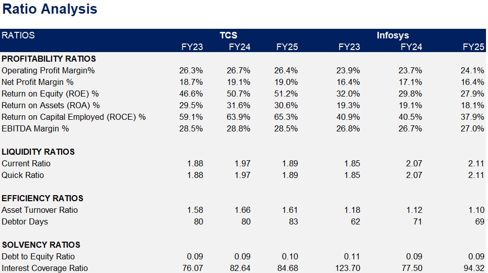
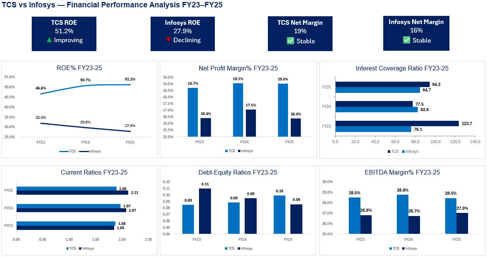

# Financial Statement Analysis: TCS vs Infosys

## Project Highlights

* Conducted a comparative financial statement analysis of TCS and Infosys over FY23–FY25.
* Evaluated profitability, liquidity, efficiency, and solvency using key financial ratios.
* Analyzed financial trends to assess operational performance and financial health.
* Derived business insights and investment-oriented conclusions based on financial data.

## Project Overview

This project presents a comparative financial statement analysis of Tata Consultancy Services (TCS) and Infosys over a three-year period (FY23–FY25). The objective was to evaluate the financial performance, operational efficiency, liquidity position, and solvency of both companies using key financial ratios and trend analysis.

## Objectives

* Compare the financial performance of TCS and Infosys.
* Assess profitability, liquidity, efficiency, and solvency.
* Identify financial strengths and weaknesses of each company.
* Derive meaningful business and investment insights from financial data.

## Tools Used

* Microsoft Excel
* Financial Statement Analysis
* Ratio Analysis
* Data Visualization

## Analysis Performed

### Profitability Analysis

* Gross Profit Margin
* EBITDA Margin
* Net Profit Margin
* Return on Equity (ROE)
* Return on Assets (ROA)

### Liquidity Analysis

* Current Ratio
* Quick Ratio

### Efficiency Analysis

* Asset Turnover Ratio
* Debtor Days

### Solvency Analysis

* Debt-to-Equity Ratio
* Interest Coverage Ratio

## Key Findings

### Profitability

* TCS consistently outperformed Infosys across major profitability metrics.
* TCS demonstrated stronger returns through higher ROE and ROA.
* EBITDA and Net Profit Margins remained healthy for both companies, with TCS maintaining a clear advantage.

### Liquidity

* Both companies maintained strong liquidity positions throughout the analysis period.
* Infosys displayed slightly stronger short-term liquidity ratios.

### Efficiency

* TCS utilized assets more efficiently to generate revenue.
* Infosys showed faster receivables collection and better debtor management.

### Solvency

* Both companies operated with low leverage and strong interest coverage.
* Financial risk remained minimal for both organizations.

## Conclusion

TCS emerged as the stronger performer over the analysis period due to its superior profitability, higher shareholder returns, and stronger operational efficiency. While Infosys maintained a stable financial position with healthy liquidity and low leverage, TCS demonstrated greater overall financial strength and value creation potential.

## Repository Contents

* TCS_vs_Infosys_Financial_Analysis.xlsx
* Ratio Analysis Screenshot
* Charts Screenshot(s)

## Project Preview

📊 [Excel Workbook](./TCS%20vs%20Infosys%20-%20Financial%20Analysis.xlsx)

### Ratio Analysis

### Charts

## Skills Demonstrated

* Financial Statement Analysis
* Financial Ratio Analysis
* Comparative Company Analysis
* Data Interpretation
* Business Insight Generation
* Microsoft Excel
* Financial Reporting
